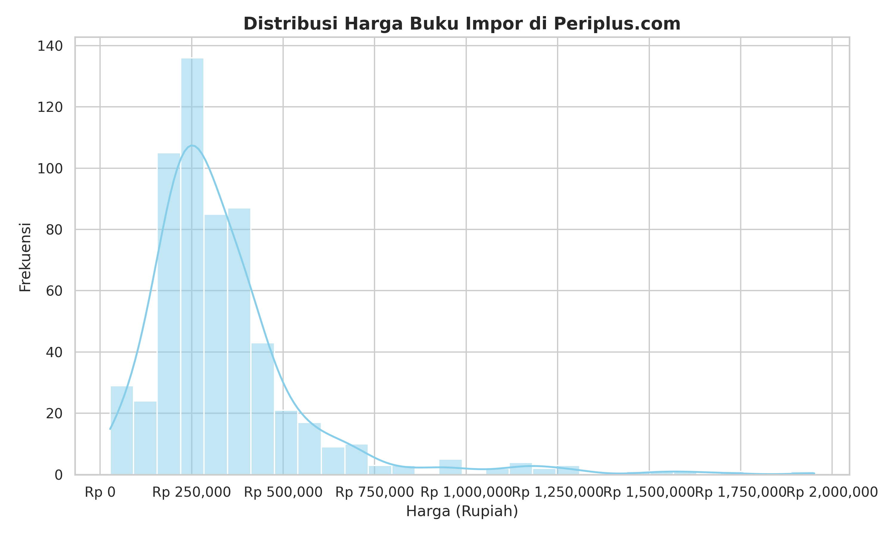
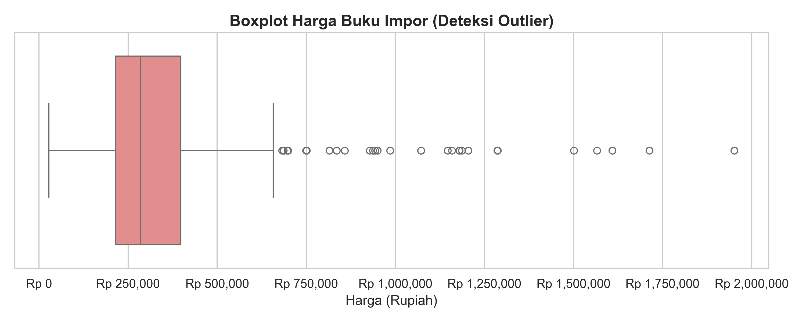
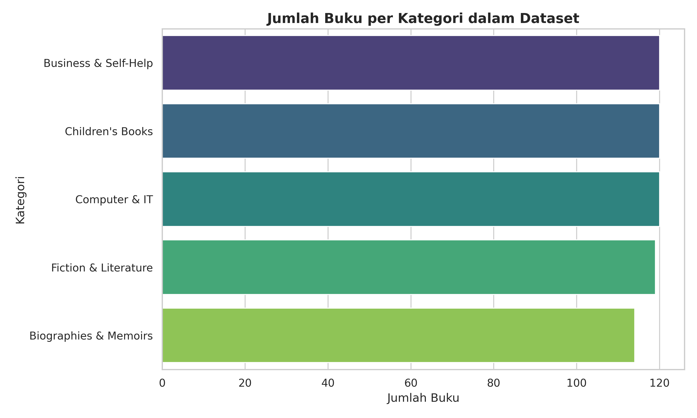
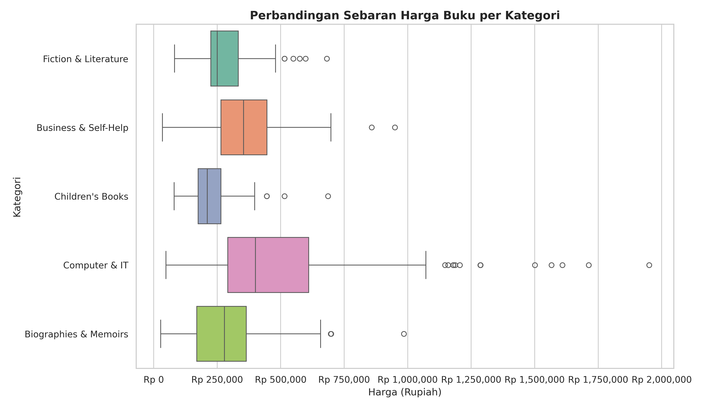

# Analisis Harga dan Kategori Buku Impor pada E-Commerce Periplus.com

**Makalah Ujian Tengah Semester (UTS)**

---

**Mata Kuliah:** Data Science (IF404)  
**Program Studi:** PJJ Informatika S1  
**Dosen Pengampu:** Ir. Ahmad Chusyairi, M.Com., CDS., IPM., ASEAN Eng  
**Semester:** Genap 2025/2026

**Disusun oleh:**

| No. | Nama Lengkap | NIM |
|-----|------|-----|
| 1 | Sutan Gading Fadhillah Nasution | 250401020159 |
| 2 | Rina Mardiana | 250401020151 |

---

**Link Google Drive:**  
*(Link akan dilampirkan setelah semua file diunggah)*

---

## Daftar Isi

- [BAB I — Pengantar Data Science](#bab-i--pengantar-data-science)
- [BAB II — Teknik Pengumpulan Data](#bab-ii--teknik-pengumpulan-data)
- [BAB III — Eksplorasi dan Kualitas Data](#bab-iii--eksplorasi-dan-kualitas-data)
- [BAB IV — Konsep Dasar Statistika dan Peringkasan Data](#bab-iv--konsep-dasar-statistika-dan-peringkasan-data)
- [BAB V — Penyajian dan Visualisasi Data](#bab-v--penyajian-dan-visualisasi-data)
- [BAB VI — Studi Kasus dan Manfaat bagi Pengguna](#bab-vi--studi-kasus-dan-manfaat-bagi-pengguna)
- [Daftar Pustaka](#daftar-pustaka)

---

## BAB I — Pengantar Data Science

### 1.1 Definisi Data Science

*Data Science* (ilmu data) merupakan disiplin ilmu interdisipliner yang menggabungkan metode ilmiah, proses, algoritma, dan sistem untuk mengekstraksi pengetahuan serta wawasan yang bermakna dari data terstruktur maupun tidak terstruktur (Dhar, 2013). Secara lebih spesifik, *data science* dapat dipahami sebagai proses transformasi data mentah menjadi informasi yang dapat ditindaklanjuti (*actionable insights*) melalui serangkaian tahapan yang meliputi pengumpulan data, pembersihan, eksplorasi, analisis statistik, dan visualisasi.

Menurut Provost dan Fawcett (2013), *data science* mencakup tiga pilar utama, yaitu:

1. **Statistika dan Matematika** — sebagai fondasi untuk menganalisis pola, distribusi, dan hubungan antar variabel dalam data.
2. **Ilmu Komputer dan Pemrograman** — sebagai sarana untuk mengotomasi proses pengumpulan, pengolahan, dan analisis data dalam skala besar.
3. **Pengetahuan Domain (*Domain Knowledge*)** — sebagai kerangka interpretatif yang memungkinkan hasil analisis data diterjemahkan menjadi rekomendasi yang relevan dengan konteks bisnis atau industri tertentu.

### 1.2 Peran Data Science dalam Industri E-Commerce

Industri *e-commerce* merupakan salah satu sektor yang paling intensif memanfaatkan *data science*. Setiap interaksi pengguna, mulai dari pencarian produk, klik halaman, hingga transaksi pembelian, menghasilkan jejak data digital (*digital footprint*) yang sangat berharga bagi pelaku bisnis. Menurut Chaffey dan Ellis-Chadwick (2019), pemanfaatan *data science* dalam *e-commerce* mencakup beberapa area strategis:

1. **Analisis Perilaku Konsumen** — Memahami pola pembelian, preferensi kategori produk, dan sensitivitas harga pelanggan melalui analisis data transaksional.
2. **Optimasi Penetapan Harga (*Dynamic Pricing*)** — Menggunakan analisis statistik untuk menentukan titik harga optimal yang memaksimalkan volume penjualan sekaligus margin keuntungan.
3. **Pengelolaan Inventaris (*Inventory Management*)** — Memanfaatkan data historis penjualan untuk memprediksi permintaan dan menghindari kelebihan atau kekurangan stok.
4. **Personalisasi Pengalaman Pengguna** — Menyajikan rekomendasi produk yang relevan berdasarkan riwayat penelusuran dan pembelian pengguna.

### 1.3 Latar Belakang Studi Kasus

Periplus.com merupakan salah satu *e-commerce* terkemuka di Indonesia yang berfokus pada penjualan buku impor berbahasa Inggris. Sebagai importir dan pengecer buku asing, Periplus menghadapi tantangan unik dalam hal penetapan harga, mengingat biaya impor, fluktuasi nilai tukar mata uang, dan variasi harga antar kategori buku yang signifikan.

Studi kasus ini bertujuan untuk menganalisis distribusi harga dan sebaran kategori buku impor pada platform Periplus.com menggunakan pendekatan *data science*. Dataset yang digunakan terdiri dari **593 produk buku** dari **5 kategori** berbeda, yang dikumpulkan melalui teknik *web scraping*. Melalui analisis statistika deskriptif dan visualisasi data, studi ini diharapkan dapat memberikan wawasan yang bermanfaat bagi strategi bisnis *e-commerce* buku impor.

---

## BAB II — Teknik Pengumpulan Data

### 2.1 Metode Pengumpulan Data

Pengumpulan data dalam studi ini dilakukan menggunakan teknik ***web scraping***, yakni proses otomatis untuk mengekstraksi informasi dari halaman web secara terprogram (Mitchell, 2018). Teknik ini dipilih karena Periplus.com tidak menyediakan API publik (*Application Programming Interface*) untuk mengakses data katalog produknya, sehingga *web scraping* menjadi alternatif yang paling efisien untuk memperoleh dataset dalam jumlah besar.

Proses *scraping* diimplementasikan menggunakan bahasa pemrograman **Python 3** dengan memanfaatkan dua pustaka (*library*) utama:

1. **`requests`** — Untuk mengirimkan *HTTP request* ke server Periplus.com dan menerima respons berupa kode HTML dari halaman web target.
2. **`BeautifulSoup4`** — Untuk melakukan *parsing* (penguraian) terhadap struktur HTML dan mengekstraksi elemen-elemen data spesifik dari halaman produk.

### 2.2 Sumber Data dan Kategori

Data diambil dari halaman katalog produk Periplus.com yang mencakup **5 kategori buku impor** berikut:

| No. | Kategori | Jumlah Produk |
|-----|----------|---------------|
| 1 | Business & Self-Help | 120 |
| 2 | Children's Books | 120 |
| 3 | Computer & IT | 120 |
| 4 | Fiction & Literature | 119 |
| 5 | Biographies & Memoirs | 114 |
| | **Total** | **593** |

Pemilihan kelima kategori tersebut didasarkan pada pertimbangan keragaman jenis buku yang merepresentasikan segmen pasar yang berbeda, mulai dari buku akademis/profesional (Computer & IT), buku populer (Fiction & Literature), buku pengembangan diri (Business & Self-Help), buku anak-anak (Children's Books), hingga buku nonfiksi (Biographies & Memoirs).

### 2.3 Atribut Data yang Dikumpulkan

Setiap produk buku yang berhasil di-*scrape* memiliki atribut-atribut berikut:

| No. | Atribut | Tipe Data | Keterangan |
|-----|---------|-----------|------------|
| 1 | `title` | String | Judul buku |
| 2 | `author` | String | Nama penulis |
| 3 | `binding` | String | Jenis penjilidan (Paperback, Hardcover, Board Books) |
| 4 | `raw_price` | String | Harga jual dalam format teks (misal: "Rp258,000") |
| 5 | `original_price` | String | Harga asli sebelum diskon (jika ada) |
| 6 | `discount_pct` | String | Persentase diskon (misal: "-37%") |
| 7 | `in_stock` | Integer | Status ketersediaan (1 = tersedia, 0 = habis) |
| 8 | `category` | String | Kategori buku |
| 9 | `product_url` | String | URL halaman produk |

### 2.4 Mekanisme Scraping

Proses *scraping* dilakukan dengan mekanisme berikut:

1. **Iterasi Halaman** — Script mengakses halaman-halaman katalog secara berurutan untuk setiap kategori, dimulai dari halaman pertama hingga seluruh produk dalam kategori tersebut berhasil diambil.
2. **Ekstraksi Elemen HTML** — Untuk setiap produk yang ditemukan pada halaman katalog, script mengekstraksi atribut-atribut yang disebutkan di atas dari elemen-elemen HTML yang relevan.
3. **Delay Acak (*Random Delay*)** — Antara setiap permintaan HTTP, script menerapkan jeda acak antara **1,0 hingga 2,5 detik** untuk menghindari pembebanan berlebih pada server target dan mengurangi risiko pemblokiran IP (*rate limiting*).
4. **Penyimpanan Data Mentah** — Seluruh data yang berhasil dikumpulkan disimpan dalam format CSV (*Comma-Separated Values*) dengan nama file `data/periplus_books_raw.csv`.

### 2.5 Etika Pengumpulan Data

Pelaksanaan *web scraping* dalam studi ini memperhatikan aspek etika sebagai berikut:

- Penggunaan *delay* acak untuk tidak membebani server Periplus.com secara berlebihan.
- Data yang dikumpulkan bersifat publik dan tersedia secara terbuka di halaman web Periplus.com.
- Data digunakan semata-mata untuk keperluan akademis (tugas UTS mata kuliah Data Science).

---

## BAB III — Eksplorasi dan Kualitas Data

### 3.1 Pemeriksaan Data Mentah

Sebelum data dapat digunakan untuk analisis statistik, perlu dilakukan pemeriksaan kualitas data mentah (*raw data*) untuk mengidentifikasi potensi masalah seperti *missing values*, format data yang tidak konsisten, dan anomali lainnya.

Hasil pemeriksaan terhadap dataset mentah `periplus_books_raw.csv` (593 baris) menunjukkan kondisi sebagai berikut:

| Kolom | Jumlah *Missing Values* | Keterangan |
|-------|-------------------------|------------|
| `title` | 0 | Lengkap |
| `author` | 3 | Tiga buku tanpa informasi penulis |
| `binding` | 0 | Lengkap |
| `raw_price` | 0 | Lengkap |
| `original_price` | 415 | Kosong pada buku yang tidak sedang didiskon |
| `discount_pct` | 415 | Kosong pada buku yang tidak sedang didiskon |
| `in_stock` | 0 | Lengkap |
| `category` | 0 | Lengkap |
| `product_url` | 0 | Lengkap |

Dari tabel di atas, terdapat dua jenis *missing values*:

1. **`author`** (3 baris) — Data penulis tidak tersedia pada halaman produk.
2. **`original_price` dan `discount_pct`** (415 baris) — Kolom ini memang hanya terisi pada produk yang sedang mendapat potongan harga. Ketidakhadiran nilai pada kolom ini menunjukkan bahwa produk tersebut dijual dengan harga normal (tanpa diskon), sehingga bukan merupakan anomali data.

### 3.2 Proses Pembersihan Data (*Data Cleaning*)

Pembersihan data dilaksanakan menggunakan script Python `scrapers/clean_data.py` dengan langkah-langkah sebagai berikut:

#### 3.2.1 Transformasi Kolom Harga

Kolom harga pada data mentah tersimpan dalam format teks (contoh: `"Rp258,000"`). Proses transformasi meliputi:

- Penghapusan karakter non-numerik (prefix "Rp", spasi, tanda titik pemisah ribuan).
- Konversi dari tipe data `string` ke `float` untuk memungkinkan operasi aritmatika.
- Hasil konversi disimpan ke kolom baru: `price_idr` (harga jual) dan `original_price_idr` (harga asli).

#### 3.2.2 Penanganan *Missing Values*

| Kolom | Strategi Penanganan |
|-------|---------------------|
| `price_idr` | Baris tanpa harga jual dihapus (*drop*) |
| `original_price_idr` | Diisi dengan nilai `price_idr` (buku tanpa diskon = harga jual sama dengan harga asli) |
| `discount_percent` | Diisi dengan nilai `0.0` (tidak ada diskon) |
| `author` | Diisi dengan nilai `"Unknown Author"` |
| `binding` | Diisi dengan nilai `"Unknown Binding"` (jika kosong) |

#### 3.2.3 Penghapusan Kolom Mentah

Setelah transformasi selesai, kolom-kolom mentah yang sudah tidak diperlukan (`raw_price`, `original_price`, `discount_pct`) dihapus dari dataset untuk menjaga kebersihan struktur data.

### 3.3 Struktur Dataset Bersih

Dataset bersih (`data/periplus_books_clean.csv`) yang dihasilkan memiliki spesifikasi sebagai berikut:

| Properti | Nilai |
|----------|-------|
| Jumlah baris | 593 |
| Jumlah kolom | 9 |
| *Missing values* | 0 (tidak ada) |
| Format file | CSV (*Comma-Separated Values*) |

Struktur kolom pada dataset bersih:

| No. | Kolom | Tipe Data | Keterangan |
|-----|-------|-----------|------------|
| 1 | `title` | String | Judul buku |
| 2 | `author` | String | Nama penulis |
| 3 | `binding` | String | Jenis penjilidan |
| 4 | `in_stock` | Integer | Status ketersediaan (1/0) |
| 5 | `category` | String | Kategori buku |
| 6 | `product_url` | String | URL produk |
| 7 | `price_idr` | Float | Harga jual (Rupiah) |
| 8 | `original_price_idr` | Float | Harga asli sebelum diskon (Rupiah) |
| 9 | `discount_percent` | Float | Persentase diskon (%) |

### 3.4 Profil Sebaran Data

Berdasarkan eksplorasi awal terhadap dataset bersih, diperoleh profil sebaran data sebagai berikut:

**Sebaran Jenis Penjilidan (*Binding*):**

| Jenis Penjilidan | Jumlah | Persentase |
|-------------------|--------|------------|
| Paperback | 414 | 69,8% |
| Hardcover | 150 | 25,3% |
| Board Books | 29 | 4,9% |

**Status Ketersediaan Stok:**

| Status | Jumlah | Persentase |
|--------|--------|------------|
| Tersedia (*In Stock*) | 566 | 95,4% |
| Habis (*Out of Stock*) | 27 | 4,6% |

**Informasi Diskon:**

| Keterangan | Jumlah | Persentase |
|------------|--------|------------|
| Buku dengan diskon | 178 | 30,0% |
| Buku tanpa diskon | 415 | 70,0% |
| Rata-rata persentase diskon | 34,0% | - |
| Diskon tertinggi | 92% | - |

---

## BAB IV — Konsep Dasar Statistika dan Peringkasan Data

### 4.1 Konsep Statistika Deskriptif

Statistika deskriptif merupakan cabang statistika yang bertujuan untuk meringkas, menggambarkan, dan menyajikan data secara sistematis tanpa melakukan generalisasi terhadap populasi yang lebih luas (Walpole *et al.*, 2012). Dalam konteks analisis data, statistika deskriptif dibagi menjadi dua kelompok utama:

1. **Ukuran Pemusatan Data (*Measures of Central Tendency*)** — Menunjukkan titik pusat atau nilai tipikal dari sekumpulan data. Meliputi rata-rata (*mean*), nilai tengah (*median*), dan modus (*mode*).
2. **Ukuran Penyebaran Data (*Measures of Dispersion*)** — Menunjukkan seberapa jauh data tersebar dari titik pusatnya. Meliputi rentang (*range*), varians, standar deviasi, kuartil, dan *Interquartile Range* (IQR).

### 4.2 Ukuran Pemusatan Data

#### 4.2.1 Rata-Rata (*Mean*)

Rata-rata aritmatika dihitung dengan menjumlahkan seluruh nilai data, kemudian membaginya dengan banyaknya data. Secara formal:

$$\bar{x} = \frac{1}{n} \sum_{i=1}^{n} x_i$$

#### 4.2.2 Nilai Tengah (*Median*)

Median adalah nilai yang membagi data terurut menjadi dua bagian sama besar. Jika jumlah data ganjil, median adalah nilai tengah; jika genap, median adalah rata-rata dari dua nilai tengah.

#### 4.2.3 Modus (*Mode*)

Modus adalah nilai yang paling sering muncul dalam kumpulan data. Data dapat memiliki satu modus (*unimodal*), dua modus (*bimodal*), atau lebih.

### 4.3 Ukuran Penyebaran Data

#### 4.3.1 Rentang (*Range*)

Rentang merupakan selisih antara nilai maksimum dan minimum dalam data:

$$\text{Range} = x_{max} - x_{min}$$

#### 4.3.2 Varians dan Standar Deviasi

Varians mengukur rata-rata kuadrat simpangan setiap data terhadap rata-ratanya. Standar deviasi merupakan akar kuadrat dari varians, yang memiliki satuan sama dengan data asli sehingga lebih mudah diinterpretasikan.

$$s^2 = \frac{1}{n-1} \sum_{i=1}^{n} (x_i - \bar{x})^2 \qquad;\qquad s = \sqrt{s^2}$$

> **Catatan:** Varians berdimensi kuadrat dari satuan data (dalam hal ini Rp²), sedangkan standar deviasi berdimensi sama dengan data asli (Rp).

#### 4.3.3 Kuartil dan *Interquartile Range* (IQR)

Kuartil membagi data terurut menjadi empat bagian sama besar:

- **Q1 (Kuartil 1):** Nilai pada persentil ke-25 memisahkan 25% data terendah.
- **Q2 (Kuartil 2):** Sama dengan median (persentil ke-50).
- **Q3 (Kuartil 3):** Nilai pada persentil ke-75 memisahkan 25% data tertinggi.

*Interquartile Range* (IQR) adalah selisih antara Q3 dan Q1, yang merepresentasikan sebaran 50% data bagian tengah:

$$\text{IQR} = Q3 - Q1$$

#### 4.3.4 Deteksi Pencilan (*Outliers*) dengan Metode IQR

Pencilan adalah observasi yang nilainya jauh menyimpang dari sebagian besar data lainnya. Metode IQR mendefinisikan batas pencilan sebagai berikut:

- **Batas Bawah:** $Q1 - 1{,}5 \times \text{IQR}$
- **Batas Atas:** $Q3 + 1{,}5 \times \text{IQR}$

Observasi yang berada di bawah batas bawah atau di atas batas atas dikategorikan sebagai pencilan.

### 4.4 Hasil Kalkulasi Statistika Deskriptif

Berikut adalah hasil penerapan statistika deskriptif terhadap variabel `price_idr` (harga jual buku dalam Rupiah) pada dataset 593 buku impor Periplus.com:

#### 4.4.1 Ringkasan Statistik Keseluruhan

| Ukuran Statistik | Nilai |
|-------------------|-------|
| Rata-rata (*Mean*) | Rp338.934,06 |
| Nilai Tengah (*Median*) | Rp285.000,00 |
| Modus (*Mode*) | Rp238.000,00 |
| Standar Deviasi | Rp229.897,13 |
| Varians | 52.852.689.133,29 (Rp²) |
| Nilai Minimum | Rp27.300,00 |
| Nilai Maksimum | Rp1.951.000,00 |
| Rentang (*Range*) | Rp1.923.700,00 |
| Kuartil 1 (Q1) | Rp215.000,00 |
| Kuartil 3 (Q3) | Rp398.000,00 |
| IQR | Rp183.000,00 |
| Batas Bawah Pencilan | Rp−59.500,00 |
| Batas Atas Pencilan | Rp672.500,00 |
| Jumlah Pencilan | 37 produk |

**Interpretasi:**

- **Mean > Median > Mode** (Rp338.934 > Rp285.000 > Rp238.000) mengindikasikan bahwa distribusi harga bersifat **condong ke kanan (*right-skewed* / *positive skew*)**. Hal ini dikonfirmasi oleh nilai *skewness* sebesar **2,8728** (positif, cukup besar), yang menunjukkan adanya ekor panjang di sisi harga tinggi.
- **Standar deviasi** yang besar (Rp229.897) relatif terhadap *mean* menunjukkan **variasi harga yang tinggi** antar produk. Koefisien variasi (*coefficient of variation*) mencapai sekitar 67,8%, artinya harga buku impor sangat beragam.
- **Batas bawah pencilan bernilai negatif** (Rp−59.500), yang berarti tidak ada pencilan di sisi bawah karena harga tidak mungkin negatif. Seluruh **37 pencilan** berada di sisi atas (harga > Rp672.500).

#### 4.4.2 Statistik Deskriptif per Kategori

| Kategori | Jumlah | Rata-rata (Rp) | Median (Rp) | Std. Deviasi (Rp) | Min (Rp) | Max (Rp) |
|----------|--------|------------|--------|-------------|------|------|
| Computer & IT | 120 | 527.758 | 401.000 | 375.927 | 48.300 | 1.951.000 |
| Business & Self-Help | 120 | 369.193 | 354.000 | 150.045 | 34.300 | 950.000 |
| Biographies & Memoirs | 114 | 284.011 | 278.500 | 166.596 | 27.300 | 985.000 |
| Fiction & Literature | 119 | 280.946 | 250.000 | 100.989 | 82.000 | 682.000 |
| Children's Books | 120 | 229.534 | 211.500 | 86.197 | 80.750 | 686.000 |

**Interpretasi per Kategori:**

- **Computer & IT** merupakan kategori dengan harga rata-rata tertinggi (Rp527.758) sekaligus variasi harga terluas (standar deviasi Rp375.927). Hal ini mencerminkan sifat buku IT/komputer yang sering berupa *textbook* akademis atau referensi profesional dengan harga premium.
- **Children's Books** memiliki harga rata-rata terendah (Rp229.534) dengan standar deviasi paling kecil (Rp86.197), menunjukkan segmen harga yang paling homogen dan terjangkau.
- **Fiction & Literature** memiliki median terendah (Rp250.000) dengan sebaran harga yang relatif rapat, mengindikasikan harga buku fiksi yang cenderung stabil dan kompetitif.
- Pada kategori **Business & Self-Help** dan **Biographies & Memoirs**, nilai mean dan median relatif berdekatan, menunjukkan distribusi harga yang lebih simetris dibandingkan Computer & IT.

#### 4.4.3 Distribusi Pencilan per Kategori

| Kategori | Jumlah Pencilan |
|----------|-----------------|
| Computer & IT | 27 |
| Business & Self-Help | 5 |
| Biographies & Memoirs | 3 |
| Fiction & Literature | 1 |
| Children's Books | 1 |
| **Total** | **37** |

Dari 37 pencilan, **27 (73%)** berasal dari kategori Computer & IT, yang mengkonfirmasi bahwa kategori ini memiliki variasi harga yang paling ekstrem.

---

## BAB V — Penyajian dan Visualisasi Data

### 5.1 Peran Visualisasi dalam Data Science

Visualisasi data merupakan komponen krusial dalam proses *data science* yang berfungsi untuk mengkomunikasikan temuan analitis secara visual agar lebih mudah dipahami oleh pemangku kepentingan (Tufte, 2001). Visualisasi yang efektif memungkinkan pengidentifikasian pola, tren, dan anomali yang mungkin tidak terlihat dari tabel angka semata.

Dalam studi ini, digunakan empat jenis visualisasi yang masing-masing memiliki tujuan analitis berbeda.

### 5.2 Histogram — Distribusi Harga Buku Impor

**Gambar 1.** Histogram distribusi harga buku impor dengan kurva *Kernel Density Estimation* (KDE).

**Deskripsi:**

Histogram di atas menampilkan distribusi frekuensi harga jual buku impor pada 30 interval harga (*bins*). Sumbu horizontal menunjukkan harga dalam Rupiah, sedangkan sumbu vertikal menunjukkan jumlah buku pada masing-masing interval. Kurva biru (*KDE*) merupakan estimasi kepadatan probabilitas yang menunjukkan bentuk umum distribusi.

**Analisis:**

- Distribusi menunjukkan pola **condong ke kanan (*right-skewed*)** yang sangat jelas, di mana mayoritas buku berada pada kisaran harga Rp100.000 – Rp400.000.
- Puncak distribusi (*peak/mode*) berada di sekitar Rp200.000 – Rp250.000, yang menjadi rentang harga paling umum untuk buku impor.
- Ekor panjang ke kanan mencapai hampir Rp2.000.000, menunjukkan keberadaan buku-buku premium dengan harga jauh di atas mayoritas.
- Nilai *skewness* = 2,8728 dan *kurtosis* = 11,9725 secara kuantitatif mengonfirmasi distribusi yang sangat condong dan memiliki ekor berat (*heavy-tailed*).

### 5.3 Boxplot — Deteksi Pencilan Harga

**Gambar 2.** Boxplot harga buku impor untuk deteksi pencilan.

**Deskripsi:**

Boxplot menampilkan ringkasan lima angka (*five-number summary*): nilai minimum, Q1, median (garis tengah dalam kotak), Q3, dan nilai maksimum. Titik-titik di luar *whisker* (garis horizontal terpanjang) merupakan pencilan.

**Analisis:**

- **Kotak (IQR)** membentang dari Rp215.000 (Q1) hingga Rp398.000 (Q3), menunjukkan bahwa 50% data tengah berada pada rentang Rp183.000.
- **Garis median** berada di kiri pusat kotak, mengonfirmasi kemiringan distribusi ke kanan.
- **Whisker kanan** berakhir di sekitar Rp672.500 (batas atas pencilan).
- Terdapat **37 titik pencilan** yang tersebar di sisi kanan, dengan nilai tertinggi mencapai Rp1.951.000. Titik-titik ini dominan berasal dari kategori Computer & IT.

### 5.4 Bar Chart — Sebaran Jumlah Buku per Kategori

**Gambar 3.** Diagram batang (*bar chart*) jumlah buku per kategori.

**Deskripsi:**

Diagram batang horizontal menampilkan jumlah produk buku pada setiap kategori. Panjang batang merepresentasikan banyaknya buku yang berhasil dikumpulkan dari masing-masing kategori.

**Analisis:**

- Distribusi jumlah buku antar kategori relatif **seimbang**, dengan rentang antara 114 (Biographies & Memoirs) hingga 120 buku (Business & Self-Help, Children's Books, Computer & IT).
- Keseimbangan ini penting karena menunjukkan bahwa perbandingan statistik antar kategori (Bab IV, Tabel 4.4.2) tidak terdistorsi oleh perbedaan ukuran sampel yang signifikan.
- Kategori Fiction & Literature memiliki 119 buku, sedangkan Biographies & Memoirs memiliki jumlah terendah yaitu 114 buku.

### 5.5 Boxplot per Kategori — Perbandingan Sebaran Harga

**Gambar 4.** Boxplot harga buku impor per kategori.

**Deskripsi:**

Boxplot ini menampilkan perbandingan distribusi harga untuk masing-masing kategori secara berdampingan, sehingga perbedaan sebaran harga antar kategori dapat dilihat secara visual.

**Analisis:**

- **Computer & IT** memiliki kotak (IQR) terlebar dan *whisker* terpanjang, mengindikasikan variasi harga yang paling tinggi. Pencilan pada kategori ini mencapai hampir Rp2.000.000.
- **Children's Books** memiliki kotak terkecil dan posisi paling rendah pada sumbu harga, mengkonfirmasi bahwa buku anak memiliki harga yang paling rendah dan paling konsisten.
- **Business & Self-Help** menunjukkan kotak yang cukup lebar di area harga menengah (Rp250.000 – Rp500.000) dengan beberapa pencilan di kisaran Rp750.000 – Rp950.000.
- **Fiction & Literature** memiliki kotak yang kompak di area harga rendah-menengah, dengan sedikit pencilan.
- **Biographies & Memoirs** menunjukkan sebaran serupa dengan Fiction & Literature, namun dengan beberapa pencilan di sisi harga tinggi (hingga sekitar Rp985.000).

---

## BAB VI — Studi Kasus dan Manfaat bagi Pengguna

### 6.1 Ringkasan Temuan Utama

Berdasarkan analisis statistika deskriptif dan visualisasi data yang telah dilakukan pada **593 produk buku impor** dari **5 kategori** di Periplus.com, diperoleh temuan-temuan utama sebagai berikut:

1. **Distribusi Harga Condong ke Kanan (*Right-Skewed*)** — Rata-rata harga buku impor (Rp338.934) berada jauh di atas nilai median (Rp285.000), yang disebabkan oleh keberadaan sejumlah buku berharga sangat tinggi, khususnya dari kategori Computer & IT. Implikasi praktisnya, median lebih tepat digunakan sebagai ukuran representatif harga "tipikal" buku impor dibandingkan *mean*.

2. **Disparitas Harga Antar Kategori Sangat Signifikan** — Kategori Computer & IT memiliki rata-rata harga 2,3 kali lipat dari Children's Books (Rp527.758 vs Rp229.534). Hal ini mencerminkan perbedaan fundamental dalam biaya produksi, target pasar, dan nilai konten antar segmen buku.

3. **Pencilan Terkonsentrasi pada Kategori IT** — Dari 37 pencilan yang terdeteksi, 27 (73%) berasal dari kategori Computer & IT, yang menunjukkan bahwa buku-buku IT profesional dan akademis memiliki rentang harga yang paling luas dan sering mencapai harga premium.

4. **Mayoritas Buku Dijual Tanpa Diskon** — Sebanyak 70% buku (415 dari 593) dijual dengan harga penuh, sementara buku-buku yang mendapat diskon memiliki rata-rata potongan harga sebesar 34%.

### 6.2 Rekomendasi Bisnis bagi Periplus.com

Berdasarkan temuan di atas, berikut disajikan sejumlah rekomendasi strategis yang dapat dipertimbangkan oleh manajemen Periplus.com:

#### 6.2.1 Strategi Bundling untuk Buku Anak

Kategori Children's Books memiliki harga rata-rata terendah (Rp229.534) dengan standar deviasi paling kecil, menunjukkan segmen harga yang stabil dan terjangkau. Periplus dapat memanfaatkan karakteristik ini dengan membuat **paket *bundling*** berisi 3–4 buku anak dengan harga paket yang menarik, guna meningkatkan nilai transaksi rata-rata (*Average Order Value*). Strategi ini relevan karena pembelian buku anak sering dilakukan oleh orang tua yang cenderung membeli lebih dari satu buku dalam satu transaksi.

#### 6.2.2 Kampanye Harga Terjangkau untuk Buku Fiksi dan Biografi

Kategori Fiction & Literature dan Biographies & Memoirs memiliki median harga di bawah Rp280.000. Periplus dapat membuat **halaman promosi khusus** bertema "Buku Impor di Bawah Rp250.000" yang mengkurasi buku-buku populer dari kedua kategori ini. Kampanye semacam ini dapat menarik pembeli impulsif dan memperluas basis pelanggan yang selama ini mungkin menganggap buku impor terlalu mahal.

#### 6.2.3 Optimasi Stok pada Kategori IT

Data menunjukkan bahwa **17 dari 27 buku *out-of-stock*** (63%) berasal dari kategori Computer & IT, yang sekaligus merupakan kategori dengan harga tertinggi. Hal ini menunjukkan potensi *lost revenue* yang signifikan. Periplus sebaiknya **memprioritaskan pengadaan ulang (*restocking*) buku IT yang sering kehabisan stok** dan mempertimbangkan sistem notifikasi (*back-in-stock alert*) bagi pelanggan yang tertarik.

### 6.3 Manfaat bagi Pengguna

Studi kasus ini menunjukkan bagaimana pendekatan *data science* dapat memberikan manfaat nyata bagi berbagai pemangku kepentingan dalam ekosistem *e-commerce* buku:

1. **Bagi Manajemen E-Commerce** — Analisis harga dan distribusi kategori memberikan landasan data (*data-driven*) untuk pengambilan keputusan strategis terkait penetapan harga, pengelolaan inventaris, dan perancangan kampanye pemasaran.

2. **Bagi Konsumen** — Pemahaman terhadap sebaran harga per kategori membantu konsumen dalam membandingkan harga dan menemukan produk dengan nilai terbaik (*best value*).

3. **Bagi Akademisi dan Peneliti** — Dataset dan metodologi analisis yang digunakan dalam studi ini dapat dijadikan referensi untuk penelitian lanjutan tentang dinamika harga buku impor di pasar Indonesia.

### 6.4 Keterbatasan Studi

Studi ini memiliki beberapa keterbatasan yang perlu diperhatikan:

1. **Cakupan Waktu (*Cross-sectional*)** — Data dikumpulkan pada satu titik waktu tertentu, sehingga tidak dapat menangkap dinamika perubahan harga dari waktu ke waktu (*time series*).
2. **Jumlah Kategori** — Hanya mencakup 5 dari seluruh kategori yang tersedia di Periplus.com. Kategori lain seperti Art, Science, atau Health belum termasuk.
3. **Variabel Terbatas** — Analisis hanya berfokus pada harga jual. Variabel lain seperti jumlah halaman, tahun terbit, penerbit, dan rating pembeli tidak disertakan dalam dataset.

---

## Daftar Pustaka

- Chaffey, D., & Ellis-Chadwick, F. (2019). *Digital Marketing: Strategy, Implementation and Practice* (7th ed.). Pearson Education.
- Dhar, V. (2013). Data Science and Prediction. *Communications of the ACM*, 56(12), 64–73.
- Mitchell, R. (2018). *Web Scraping with Python: Collecting More Data from the Modern Web* (2nd ed.). O'Reilly Media.
- Provost, F., & Fawcett, T. (2013). *Data Science for Business*. O'Reilly Media.
- Tufte, E. R. (2001). *The Visual Display of Quantitative Information* (2nd ed.). Graphics Press.
- Walpole, R. E., Myers, R. H., Myers, S. L., & Ye, K. (2012). *Probability and Statistics for Engineers and Scientists* (9th ed.). Pearson Education.
